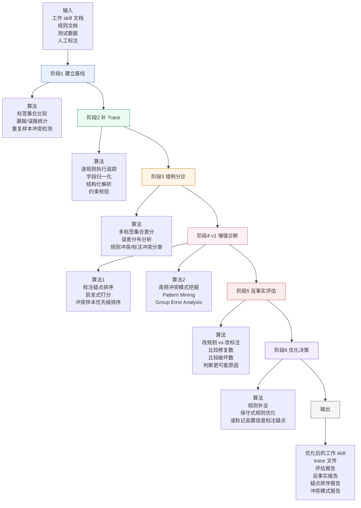

# skill-ops-v1 流程与算法图

```mermaid
flowchart TD
    A[输入\n工作 skill 文档\n规则文档\n测试数据\n人工标注] --> B[阶段1 建立基线]
    B --> B1[算法\n标签集合比较\n漏报/误报统计\n重复样本冲突检测]
    B --> C[阶段2 补 Trace]
    C --> C1[算法\n逐规则执行追踪\n字段归一化\n结构化解析\n约束校验]
    C --> D[阶段3 错例分诊]
    D --> D1[算法\n多标签集合差分\n误差分布分析\n规则冲突/标注冲突分类]
    D --> E[阶段4 v1 增强诊断]
    E --> E1[算法1\n标注疑点排序\n启发式打分\n冲突样本优先级排序]
    E --> E2[算法2\n高频冲突模式挖掘\nPattern Mining\nGroup Error Analysis]
    E --> F[阶段5 反事实评估]
    F --> F1[算法\n改规则 vs 改标注\n比较修复数\n比较破坏数\n判断更可能原因]
    F --> G[阶段6 优化决策]
    G --> G1[算法\n规则补全\n保守式规则优化\n或标记高置信度标注疑点]
    G --> H[输出]
    H --> H1[优化后的工作 skill\ntrace 文件\n评估报告\n反事实报告\n疑点排序报告\n冲突模式报告]

    style B fill:#E8F1FF,stroke:#4A78C2,stroke-width:1px
    style C fill:#EAFBF2,stroke:#2F8F5B,stroke-width:1px
    style D fill:#FFF4E6,stroke:#D17B00,stroke-width:1px
    style E fill:#FFF0F6,stroke:#C05A9D,stroke-width:1px
    style F fill:#FDECEC,stroke:#C94B4B,stroke-width:1px
    style G fill:#F3ECFF,stroke:#7B5AC7,stroke-width:1px
    style H fill:#F5F5F5,stroke:#666666,stroke-width:1px
```

## 图示重点

- 相比 `skill-ops`，`skill-ops-v1` 在“错例分诊”和“优化决策”之间新增了一层增强诊断。
- 新增算法：`标注疑点排序` 与 `高频冲突模式挖掘`。
- 适合 PPT 讲法：强调 `skill-ops-v1` 不只是优化规则，还能系统判断“该改规则还是该怀疑标注”。
