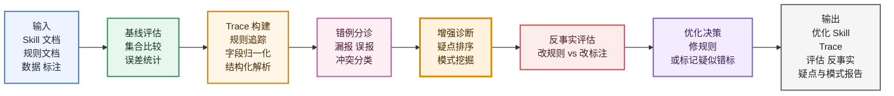

# skill-ops-v1 流程与算法图（PPT版）

```mermaid
flowchart LR
    A[输入\nSkill 文档\n规则文档\n数据 标注] --> B[基线评估\n集合比较\n误差统计]
    B --> C[Trace 构建\n规则追踪\n字段归一化\n结构化解析]
    C --> D[错例分诊\n漏报 误报\n冲突分类]
    D --> E[增强诊断\n疑点排序\n模式挖掘]
    E --> F[反事实评估\n改规则 vs 改标注]
    F --> G[优化决策\n修规则\n或标记疑似错标]
    G --> H[输出\n优化 Skill\nTrace\n评估 反事实\n疑点与模式报告]

    style A fill:#EEF4FF,stroke:#4A78C2,stroke-width:2px,color:#1F2A44
    style B fill:#E8F7EE,stroke:#2F8F5B,stroke-width:2px,color:#163322
    style C fill:#FFF6E8,stroke:#D17B00,stroke-width:2px,color:#4A2A00
    style D fill:#FDEFF3,stroke:#C05A9D,stroke-width:2px,color:#4A1834
    style E fill:#FFF3E0,stroke:#E08A00,stroke-width:3px,color:#4A2A00
    style F fill:#FDECEC,stroke:#C94B4B,stroke-width:2px,color:#4A1F1F
    style G fill:#F3ECFF,stroke:#7B5AC7,stroke-width:2px,color:#2F1F52
    style H fill:#F5F5F5,stroke:#666666,stroke-width:2px,color:#222222
```

## PPT 讲解词

- 相比 skill-ops，v1 的关键升级是新增“增强诊断层”。
- 新算法：标注疑点排序 + 高频冲突模式挖掘。
- 价值：不仅能优化规则，还能判断“该改规则还是该怀疑标注”。
