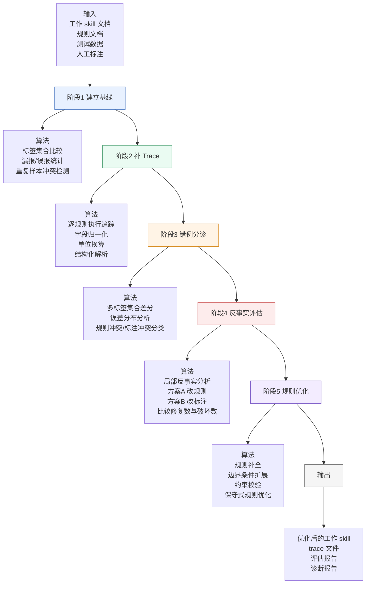

# skill-ops 流程与算法图

```mermaid
flowchart TD
    A[输入\n工作 skill 文档\n规则文档\n测试数据\n人工标注] --> B[阶段1 建立基线]
    B --> B1[算法\n标签集合比较\n漏报/误报统计\n重复样本冲突检测]
    B --> C[阶段2 补 Trace]
    C --> C1[算法\n逐规则执行追踪\n字段归一化\n单位换算\n结构化解析]
    C --> D[阶段3 错例分诊]
    D --> D1[算法\n多标签集合差分\n误差分布分析\n规则冲突/标注冲突分类]
    D --> E[阶段4 反事实评估]
    E --> E1[算法\n局部反事实分析\n方案A 改规则\n方案B 改标注\n比较修复数与破坏数]
    E --> F[阶段5 规则优化]
    F --> F1[算法\n规则补全\n边界条件扩展\n约束校验\n保守式规则优化]
    F --> G[输出]
    G --> G1[优化后的工作 skill\ntrace 文件\n评估报告\n诊断报告]

    style B fill:#E8F1FF,stroke:#4A78C2,stroke-width:1px
    style C fill:#EAFBF2,stroke:#2F8F5B,stroke-width:1px
    style D fill:#FFF4E6,stroke:#D17B00,stroke-width:1px
    style E fill:#FDECEC,stroke:#C94B4B,stroke-width:1px
    style F fill:#F3ECFF,stroke:#7B5AC7,stroke-width:1px
    style G fill:#F5F5F5,stroke:#666666,stroke-width:1px
```

## 图示重点

- 主流程：基线 -> Trace -> 分诊 -> 反事实评估 -> 规则优化 -> 交付物。
- 核心算法：规则执行追踪、集合差分、重复样本冲突检测、局部反事实评估、保守式规则优化。
- 适合 PPT 讲法：强调 `skill-ops` 主要解决“如何把规则型 Agent 从不可解释变成可诊断、可优化”。
