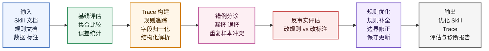

# skill-ops 流程与算法图（PPT版）

```mermaid
flowchart LR
    A[输入\nSkill 文档\n规则文档\n数据 标注] --> B[基线评估\n集合比较\n误差统计]
    B --> C[Trace 构建\n规则追踪\n字段归一化\n结构化解析]
    C --> D[错例分诊\n漏报 误报\n重复样本冲突]
    D --> E[反事实评估\n改规则 vs 改标注]
    E --> F[规则优化\n规则补全\n边界修正\n保守更新]
    F --> G[输出\n优化 Skill\nTrace\n评估与诊断报告]

    style A fill:#EEF4FF,stroke:#4A78C2,stroke-width:2px,color:#1F2A44
    style B fill:#E8F7EE,stroke:#2F8F5B,stroke-width:2px,color:#163322
    style C fill:#FFF6E8,stroke:#D17B00,stroke-width:2px,color:#4A2A00
    style D fill:#FDEFF3,stroke:#C05A9D,stroke-width:2px,color:#4A1834
    style E fill:#FDECEC,stroke:#C94B4B,stroke-width:2px,color:#4A1F1F
    style F fill:#F3ECFF,stroke:#7B5AC7,stroke-width:2px,color:#2F1F52
    style G fill:#F5F5F5,stroke:#666666,stroke-width:2px,color:#222222
```

## PPT 讲解词

- 核心闭环：基线评估 -> Trace 构建 -> 错例分诊 -> 反事实评估 -> 规则优化。
- 核心算法：规则执行追踪、集合差分、冲突检测、局部反事实分析、保守式规则优化。
