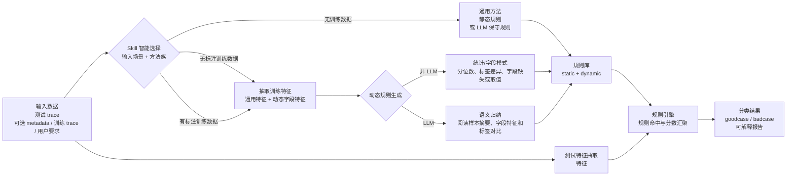

# Trace Sorter

`trace-sorter` 是一个用于 Agent trace 分类的 Codex skill。它把 trace 判定为 `goodcase` 或 `badcase`，并优先输出可解释的规则命中原因。

当前项目结构按两个维度重新组织：

1. **方法族**：非 LLM 方法、LLM 方法。
2. **训练输入场景**：无训练数据、无标注 trace 作为训练数据、有标注 trace 作为训练数据。

代码流程上明确分为两阶段：

```text
训练阶段：读取训练 trace -> 抽取通用特征和动态字段特征 -> 生成规则文件
测试阶段：读取测试 trace -> 加载规则文件 -> 输出预测和报告
```

## 项目结构

```text
TraceSorter/
|-- SKILL.md
|-- Readme.md
|-- compare.md
`-- scripts/
    |-- run_experiments.py          # 批量实验入口：训练 + 测试
    |-- run_trace_analysis.py       # 单次/批量直接分类入口：只测试，不训练
    |-- llm_rule_prompt.py          # LLM prompt、call_llm 钩子、LLM 规则报告
    |-- trace_io.py                 # trace 和 metadata 读取
    |-- features.py                 # trace 特征抽取、final-answer 识别
    |-- rule_generation.py          # 非 LLM 动态规则生成
    |-- rule_engine.py              # 规则匹配和 good/bad 分数汇聚
    |-- metrics.py                  # 指标计算
    |-- reporting.py                # Markdown 报告输出
    |-- experiment_components/      # 组件标签、规则过滤、消融计划、贡献统计
    `-- rules/
        |-- static/
        |   |-- general_rules.json
        |   `-- final_answer_config.json
        `-- dynamic/
            |-- non_llm/
            |   |-- unlabeled_rules.json
            |   `-- labeled_rules.json
            `-- llm/
                |-- no_train_rules.json
                |-- unlabeled_rules.json
                `-- labeled_rules.json
```

清空上一轮实验生成的动态规则：

```powershell
python .\scripts\clear_dynamic_rules.py
```

可选清理范围：

```powershell
python .\scripts\clear_dynamic_rules.py --methods non_llm
python .\scripts\clear_dynamic_rules.py --methods llm
python .\scripts\clear_dynamic_rules.py --methods all
```

该脚本只重置动态规则 JSON，不删除目录，也不修改 `scripts/rules/static/` 下的静态规则。

## 方法矩阵

| 方法 | 方法族 | 训练输入场景 | 训练阶段做什么 | 测试阶段加载什么 |
|---|---|---|---|---|
| `non_llm_no_train` | 非 LLM | 无训练数据 | 不训练 | `static/general_rules.json` |
| `non_llm_unlabeled` | 非 LLM | 无标注 trace | 从通用特征和动态字段特征中生成异常阈值规则 | 通用规则 + `dynamic/non_llm/unlabeled_rules.json` |
| `non_llm_labeled` | 非 LLM | 有标注 trace | 比较 train 中 goodcase/badcase 的通用特征和字段特征差异，生成区分规则 | 通用规则 + `dynamic/non_llm/labeled_rules.json` |
| `llm_no_train` | LLM | 无训练数据 | 让 LLM 根据通用特征说明生成保守通用候选规则 | 通用规则 + `dynamic/llm/no_train_rules.json` |
| `llm_unlabeled` | LLM | 无标注 trace | 让 LLM 阅读无标注训练样本的通用特征和动态字段特征，生成异常型候选规则 | 通用规则 + `dynamic/llm/unlabeled_rules.json` |
| `llm_labeled` | LLM | 有标注 trace | 让 LLM 阅读带标签训练样本的通用特征和动态字段特征，生成区分 good/bad 的候选规则 | 通用规则 + `dynamic/llm/labeled_rules.json` |

旧方法名兼容：

| 旧名 | 新名 |
|---|---|
| `general` | `non_llm_no_train` |
| `unlabeled` | `non_llm_unlabeled` |
| `labeled` | `non_llm_labeled` |
| `llm` | 根据训练数据自动映射为 `llm_labeled`、`llm_unlabeled` 或 `llm_no_train` |

## 组件化消融

当前项目把已有规则按组件自动标注，便于观察每类证据的作用。默认运行不改变原有分类逻辑；只有显式指定组件过滤或消融参数时才会改变加载的规则集合。

常见组件包括：

```text
static_hard_failure
static_structure
static_error_signal
static_result_quality
static_loop_repetition
static_final_answer
static_good_support
unlabeled_numeric_quantile
unlabeled_final_answer
unlabeled_field_presence
labeled_numeric_diff
labeled_final_answer_diff
labeled_field_presence
labeled_field_value
labeled_field_numeric
llm_rules
```

只禁用某些组件：

```powershell
python .\scripts\run_experiments.py .\traces --metadata .\metadata.csv --method non_llm_no_train --disable-components static_final_answer
```

运行当前方法的 leave-one-component-out 消融：

```powershell
python .\scripts\run_experiments.py .\traces --metadata .\metadata.csv --train-split train --eval-split test --method non_llm_labeled --ablation-plan leave_one_component_out
```

运行 only-one-component 消融：

```powershell
python .\scripts\run_experiments.py .\traces --metadata .\metadata.csv --method non_llm_no_train --ablation-plan only_one_component
```

消融报告会输出每个组件组合的指标、规则数量、被禁用或启用的组件、相对 baseline 发生变化的 case，以及 baseline 下各组件的规则数和命中贡献。

## 系统说明图



## 训练与测试数据

`run_experiments.py` 使用以下参数分开训练和测试：

| 参数 | 含义 |
|---|---|
| `trace_path` | 测试 trace 文件或目录。若不指定 `--eval-split`，默认测试这里的全部样本。 |
| `--metadata` | 测试或全集 metadata，推荐包含 `name,label,source,split`。 |
| `--eval-split` | 只测试 metadata 中 `split` 等于该值的样本；若无该 split，直接报错。 |
| `--train-trace-path` | 单独指定训练 trace 文件或目录。 |
| `--train-metadata` | 单独指定训练 metadata；省略时复用 `--metadata`。 |
| `--train-split` | 从 `trace_path` 中选择某个 split 作为训练集，例如 `train`。 |

如果既没有 `--train-trace-path`，也没有 `--train-split`，则视为“无训练数据”。这时只能运行 `non_llm_no_train` 或 `llm_no_train`；选择无标注/有标注训练方法会报错。

## Metadata 格式

推荐 CSV 列：

```text
name,label,source,split
```

示例：

```csv
name,label,source,split
case_001.json,goodcase,eval_a,train
case_002.json,badcase,eval_a,test
```

`label` 支持 `goodcase`、`badcase`，也兼容 `good`、`bad` 等别名。

## 特征与规则边界

当前项目不再只依赖一张固定特征表。训练阶段会先抽取两类特征：

1. **通用特征**：由 `features.py` 固定实现，例如 `step_count`、`error_count`、`empty_result_ratio`、`has_final_answer`。
2. **动态字段特征**：由 `features.py` 自动遍历 trace 实际字段生成，例如：
   - `field_exists:status`
   - `field_text:status`
   - `field_nonempty_ratio:plan_list[].result`
   - `field_number_mean:metrics.score`
   - `field_bool_true_ratio:flags.completed`

规则生成方法可以直接使用这些动态字段特征。因此，如果训练数据中发现某个业务字段、字段取值、字段缺失或数值大小与 good/bad 有关系，生成的规则会立刻写入动态规则文件，并在同一次测试阶段生效。

LLM 方法还可以输出 `proposed_features`。这类是真正“尚未实现的新计算特征”建议，只会进入报告，不会在当前运行中立即生效；如果 LLM 使用的是 `field_*:<path>` 这类动态字段特征，则会立即生效。

## 非 LLM 方法

### non_llm_no_train

无训练数据时使用。只加载 `scripts/rules/static/general_rules.json`。

这类规则不依赖任何数据集先验，例如：

- JSON 解析失败 -> badcase。
- trace 为空 -> badcase。
- 没有可观察步骤 -> badcase 风险。
- 出现 error、exception、timeout、failed 等错误文本 -> badcase 风险。
- 高空结果比例、连续重复动作、过多步骤 -> badcase 风险。
- 存在明确 final answer、结果非空比例高、无错误无循环 -> goodcase 支持。

### non_llm_unlabeled

使用无标注训练 trace 生成动态规则。训练逻辑在 `scripts/rule_generation.py::generate_unlabeled_rules()`。

流程：

1. 对训练 trace 抽取通用特征和动态字段特征。
2. 对风险特征计算 90 分位阈值。
3. 对训练集中高频、非空的业务字段生成“字段缺失/字段为空”异常规则。
4. 生成“相对当前训练样本异常”的 badcase 规则。
5. 如果训练样本中存在可采用的 final-answer 字段，则生成缺失 final answer 的风险规则。
6. 写入 `scripts/rules/dynamic/non_llm/unlabeled_rules.json`。

这类规则适合发现批内离群样本，不应被理解为跨业务永久阈值。

### non_llm_labeled

使用带标签训练 trace 生成动态规则。训练逻辑在 `scripts/rule_generation.py::generate_labeled_rules()`。

流程：

1. 只使用训练集中带 `goodcase` / `badcase` 标签的样本。
2. 要求训练集同时包含 goodcase 和 badcase。
3. 分别计算两类样本的通用特征均值。
4. 比较动态字段特征：字段是否出现、字段是否缺失、短文本取值、数值大小是否与 good/bad 明显相关。
5. 如果某个风险特征或字段信号在 badcase 中显著更高，则生成 badcase 阈值或字段规则。
6. 如果 final answer 在 goodcase 中明显更常见，则生成 goodcase 支持规则和 missing-final 风险规则。
7. 写入 `scripts/rules/dynamic/non_llm/labeled_rules.json`。

## LLM 方法

LLM 方法不是让模型直接给每条 trace 判标签，而是让模型生成同一 JSON schema 的候选规则，之后仍由 `rule_engine.py` 统一执行。

面向 Agent 使用时，用户不需要说明内部脚本调用顺序。只要用户给出数据路径、训练/测试 split 和“比较 LLM 方法/使用当前 Agent 自身 LLM 能力”的目标，Agent 应自动使用 Agent 自身 LLM 工作流，生成规则、运行评估并汇总结果。

LLM 方法使用 `scripts/llm_rule_prompt.py`：

- `build_prompt_from_records()` 根据训练场景生成 prompt，并把训练样本压缩为字段概要、特征统计和代表样本。
- `call_llm()` 是预留钩子，默认返回空字符串，需要你按自己的 provider 实现。
- `write_llm_rule_report()` 输出中文 `llm_rule_repoert.md`，说明 LLM 发现了哪些规则、是否发现 final-answer 字段、是否提出新特征。

### LLM 输入设计

训练 trace 可能很多、很长，LLM 方法不会默认传入全量原文。Prompt 由以下几部分组成：

1. **dataset_summary**：样本数、标签分布、source/split 分布、文本长度和步骤数统计、训练集中高频字段路径。
2. **fixed_feature_stats**：通用特征的 min/median/max 或类别计数。
3. **label_contrasts**：仅有标注场景使用，比较字段在 goodcase/badcase 中的出现率差异。
4. **selected_samples**：代表样本，不是全量样本；每条包含压缩后的特征、动态字段特征和截断后的 `trace_excerpt`。
5. **selection_policy**：说明采样策略和截断预算。

采样策略：

- 有标注场景优先保证 `goodcase` 和 `badcase` 都有代表样本。
- 无标注场景按长度、错误数、final-answer 是否存在、字段路径签名等做多样性选择。
- 长 trace 只保留 `trace_excerpt`，默认每条最多 `2000` 字符。
- 每条代表样本默认最多保留 `80` 个动态字段路径。
- Prompt 默认最多 `60000` 字符，超过后会减少代表样本并截断。

相关参数：

```powershell
--llm-max-samples 30
--llm-max-prompt-chars 60000
--llm-max-trace-chars 2000
--llm-max-dynamic-fields 80
```

这样的设计让 LLM 既能看到整体分布，也能看到足够多样的具体样例；在有标注场景中，还能明确比较正负样本差异。

`call_llm()` 签名：

```python
def call_llm(
    prompt: str,
    *,
    provider: str | None = None,
    model: str | None = None,
    temperature: float = 0.0,
    extra_args: Dict[str, Any] | None = None,
) -> str:
    return ""
```

选择任一 `llm_*` 方法时，`run_experiments.py` 会默认触发 `call_llm()`。如果你还没有实现该函数，脚本会报错，提示需要补全。

### Agent 自身 LLM 工作流

如果希望 Codex/OpenCode 当前 Agent 用自身模型生成规则，而不是让 Python 调用 `call_llm()`，使用专用入口：

```powershell
python .\scripts\run_agent_llm_workflow.py .\data\trace --metadata .\data\metadata.csv --train-split train --eval-split test --methods llm_no_train,llm_unlabeled,llm_labeled --output-dir .\results --report-output .\results\llm_methods_compare.md
```

该命令会生成：

- `results/agent_llm_tasks.json`
- `results/agent_llm_tasks.md`
- `results/agent_llm_prompts/<method>_prompt.md`

Agent 执行步骤：

1. 读取 `agent_llm_tasks.md`。
2. 分别读取每个 prompt。
3. 用当前 Agent 自身 LLM 能力生成规则 JSON。
4. 写入任务清单中对应的 `scripts/rules/dynamic/llm/*.json`。
5. 运行清单给出的评估命令。

评估命令会自动带上：

```powershell
--llm-use-existing-rules
```

因此评估阶段只加载已写好的 LLM 规则，不会触发 `call_llm()`。

## Final Answer 识别

`has_final_answer` 不再使用“trace 中存在长度大于等于 80 的字符串”这种宽松兜底。

证据来源按强度区分：

1. 用户通过 `--final-answer-item "key:value"` 指定：强证据，顶层字段和内部字段都算。
2. 用户通过 `--final-answer-config` 指定：强证据，按配置的 `top_level_keys` 和 `nested_keys` 执行。
3. 用户未指定时，脚本扫描默认候选字段：中等证据。
4. LLM 方法发现 final-answer 字段并写入配置：中等证据。
5. 如果没有用户指定、默认命中或 LLM 发现，则 `has_final_answer` 不参与 good/bad 判定。

命令行示例：

```powershell
python .\scripts\run_experiments.py .\traces --final-answer-item "your_final_answer_key:*"
```

上面的 `your_final_answer_key` 是占位字段名；实际使用时应替换成你的业务 trace 中代表最终结果的字段。`key:value`、`key: value`、`key : value` 都兼容，`*` 表示任意字符。

## 常用命令

无训练数据，使用非 LLM 通用规则测试：

```powershell
python .\scripts\run_experiments.py .\traces --method non_llm_no_train
```

从同一目录中用 `split=train` 训练、`split=test` 测试：

```powershell
python .\scripts\run_experiments.py .\traces --metadata .\metadata.csv --train-split train --eval-split test --method non_llm_unlabeled
python .\scripts\run_experiments.py .\traces --metadata .\metadata.csv --train-split train --eval-split test --method non_llm_labeled
```

使用单独训练目录和测试目录：

```powershell
python .\scripts\run_experiments.py .\test_traces --metadata .\test_metadata.csv --train-trace-path .\train_traces --train-metadata .\train_metadata.csv --method non_llm_labeled
```

对比多个非 LLM 方法：

```powershell
python .\scripts\run_experiments.py .\traces --metadata .\metadata.csv --train-split train --eval-split test --methods non_llm_no_train,non_llm_unlabeled,non_llm_labeled
```

运行 LLM 有标注方法：

```powershell
python .\scripts\run_experiments.py .\traces --metadata .\metadata.csv --train-split train --eval-split test --method llm_labeled --llm-provider custom --llm-model my-model
```

只生成 LLM prompt，不自动调用模型：

```powershell
python .\scripts\llm_rule_prompt.py .\traces --metadata .\metadata.csv --split train --training-scenario labeled --output llm_rule_prompt.md --no-report
```

`run_experiments.py` 也可以在文件底部的 `SCRIPT_ARGS` 写参数，便于 IDE 运行：

```python
if __name__ == "__main__":
    SCRIPT_ARGS = [
        r".\traces",
        "--metadata", r".\metadata.csv",
        "--train-split", "train",
        "--eval-split", "test",
        "--methods", "non_llm_no_train,non_llm_labeled",
    ]
    main(SCRIPT_ARGS)
```

## 输出

实验报告默认输出到 `--output-dir`，文件名为“方法 + 时间”：

```text
non_llm_no_train_20260513_153000.md
methods_comparison_20260513_153000.md
```

`--output` 可以指定完整 Markdown 文件路径；设置后会覆盖 `--output-dir` 自动命名。

报告包含：

- 方法族和训练输入场景。
- 训练来源、训练样本数、测试来源、测试样本数。
- final-answer policy。
- 若测试样本有标签，则输出 accuracy、precision、recall、F1 和混淆矩阵。
- 每条测试样本的预测标签、good/bad 分数和规则命中原因。

## 规则汇聚

所有方法最终都使用 `scripts/rule_engine.py`：

```text
bad_score = 命中的 badcase 规则权重之和
good_score = 命中的 goodcase 规则权重之和
```

默认判定逻辑：

```text
bad_score >= 0.60 且 bad_score >= good_score -> badcase
否则如果 good_score >= 0.50 -> goodcase
否则 -> goodcase
```

这种设计保证 LLM 和非 LLM 方法只负责“产生规则”，最终测试阶段保持同一套可复验执行逻辑。
