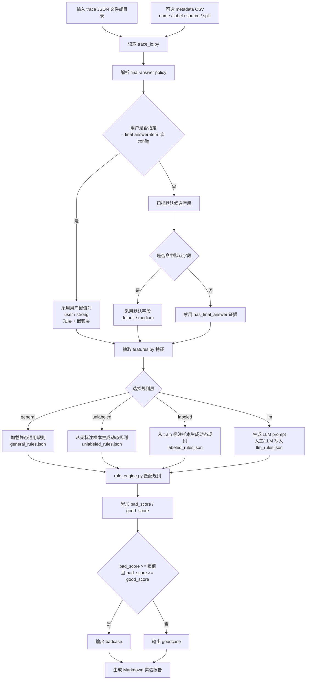

# Trace Sorter

`trace-sorter` 是一个用于 Agent trace 分类的 Codex skill。它将 trace 划分为 `goodcase` 或 `badcase`，并优先采用可解释的规则方法。当前支持三层规则：

1. 没有任何先验知识的通用静态规则。
2. 从无标注 trace 样例中萃取的动态规则。
3. 从有标注 train trace 样例中萃取的动态规则。

当前实现以确定性的非 LLM 方法为默认路径，同时提供 LLM 规则萃取入口。Codex/OpenCode 可以用自身模型根据 prompt 生成候选规则；如果要让 Python 脚本自动调用 LLM，则需要额外配置具体 provider。

## 项目结构

```text
TraceSorter/
|-- SKILL.md
|-- Readme.md
`-- scripts/
    |-- run_trace_analysis.py
    |-- run_experiments.py
    |-- trace_io.py
    |-- features.py
    |-- rule_engine.py
    |-- rule_generation.py
    |-- metrics.py
    |-- reporting.py
    `-- rules/
        |-- static/
        |   `-- general_rules.json
        `-- dynamic/
            |-- unlabeled_rules.json
            |-- labeled_rules.json
            `-- llm_rules.json
```

## 方法总览：如何从 Trace 中萃取规则

整个流程分为四步：

1. **读取 trace 与 metadata**：`trace_io.py` 读取单个 JSON 或目录下的 JSON 文件；metadata CSV 用于补充 `label`、`source`、`split` 信息。
2. **抽取行为特征**：`features.py` 遍历 trace，识别常见 Agent 轨迹结构，并抽取稳定、可解释的统计特征。
3. **生成或加载规则**：通用规则直接从静态 JSON 读取；无标注/有标注规则由 `rule_generation.py` 根据样本特征生成。
4. **执行规则并合并分数**：`rule_engine.py` 对每条 trace 匹配规则，累加 badcase/goodcase 分数，最后根据阈值输出标签。



## 关于 Codex/OpenCode 与 LLM 配置

如果是“Agent 使用 skill”，也就是 Codex 或 OpenCode 读到 `SKILL.md` 后帮你分析 trace、生成规则文件，那么 LLM 部分可以直接使用当前 Agent 自身的模型。这种模式不需要在 skill 脚本里额外配置 API key，因为模型调用发生在 Agent 会话中。

如果是“脚本自己调用 LLM”，例如你希望 `python run_experiments.py` 自动请求某个模型生成规则，那么需要额外配置：

- 模型 provider，例如 OpenAI、Anthropic、本地 vLLM、Ollama，或 OpenCode 暴露的 CLI/API。
- API key 或本地服务地址。
- 模型名、温度、最大 token 等参数。
- 失败重试、缓存、审计和成本控制策略。

本项目当前不把这些 provider 写死。原因是 Codex/OpenCode 的“当前会话模型”通常不是普通 Python 进程可以直接调用的对象；Python 脚本只能通过明确的 API、CLI 或环境变量访问模型。因此当前提供的是一个更稳的桥接方式：`llm_rule_prompt.py` 生成 prompt，由 Codex/OpenCode 或外部 LLM 产出候选规则，再写入 `llm_rules.json`。

## Trace 特征

当前会从 trace 中抽取以下主要特征：

- `parse_error`：JSON 是否解析失败。
- `is_empty_trace`：trace 是否为空。
- `has_steps`：是否存在可观察步骤、消息、事件或动作。
- `step_count` / `action_count`：可观察步骤数。
- `unique_action_count` / `unique_action_ratio`：动作多样性。
- `repeated_action_count`：重复动作总量。
- `max_consecutive_same_action`：连续相同动作的最大长度，用于识别循环或卡住。
- `error_count` / `has_error_text`：错误、异常、超时、失败等文本信号。
- `empty_result_count` / `empty_result_ratio`：空结果数量和比例。
- `nonempty_result_ratio`：非空结果比例。
- `has_final_answer` / `final_answer_chars`：是否有最终回答及其长度。
- `final_answer_source`：命中的最终回答来源，例如 `top_level:final_answer`、`nested:answer`、`assistant:content`。
- `text_chars`：trace 中可见文本长度。

这些特征的设计目标是跨 trace 格式可迁移，不绑定某一个具体 Agent 框架。

## 最终回答识别配置

早期版本曾使用“任意长度大于等于 80 的字符串”作为最终回答兜底，这容易把工具输出、日志、错误堆栈误判为 final answer。当前版本已移除该逻辑。

现在 `has_final_answer` 只由明确字段或 assistant 消息决定，并且必须先解析出本次运行采用的 final-answer 字段。

顶层字段和内部字段的区别：

- **顶层字段**：只检查 trace 根对象的直接字段，例如 `trace["final_answer"]`。这通常更适合业务最终结果字段。
- **内部字段**：递归检查 trace 内任意 dict 节点，例如某个 step、message 或 event 的 `answer` 字段。它覆盖更广，但可能命中中间过程内容。

证据采用策略：

- 用户通过 `--final-answer-item` 指定键值对模式：强证据，并且顶层字段和内部递归字段都算。
- 用户通过 `--final-answer-config` 指定字段：强证据，但严格按配置中的 `top_level_keys` 和 `nested_keys` 执行；若希望两处都算，需要同时写入两组。
- 用户未指定时，脚本先扫描输入 trace 是否命中默认候选字段：中等证据。
- LLM 方法可先让大模型判断业务 final-answer 字段，再把字段写入配置并设置 `evidence_source=llm`：中等证据。
- 如果没有用户指定、默认命中或 LLM 发现，则 `has_final_answer` 不参与 good/bad 判定。

默认候选字段：

- 顶层字段：默认 `final`、`final_answer`、`final_response`、`answer`、`response`、`output`、`result`。
- 内部字段：默认 `final_answer`、`final_response`、`answer`。
- assistant 消息：默认 `role=assistant` 且 `content` 非空。

默认配置模板：

```text
scripts/rules/static/final_answer_config.json
```

如果某个业务的最终回答形如 `business_result: <任意非空内容>` 或 `status: final_success`，可以用命令行快速追加：

```powershell
python .\scripts\run_experiments.py .\traces --final-answer-item "business_result:*" --final-answer-item "status: *success*"
```

这种写法会同时检查顶层字段和内部递归字段。冒号两侧空格会被自动兼容，例如 `status: *success*` 和 `status : *success*` 都可以。

也可以使用完整 JSON 配置：

```powershell
python .\scripts\run_experiments.py .\traces --final-answer-config .\final_answer_config.json
```

配置示例：

```json
{
  "top_level_keys": ["final_answer", "business_result"],
  "nested_keys": ["final_answer", "business_result", "summary_text"],
  "final_answer_items": ["business_result:*", "status: *success*"],
  "assistant_roles": ["assistant"],
  "assistant_content_keys": ["content"],
  "min_chars": 1,
  "evidence_source": "user"
}
```

`top_level_keys` 适合最终回答只出现在 trace 顶层的业务字段；`nested_keys` 适合可能出现在任意节点的业务字段。若字段名也会出现在中间工具结果中，应优先放在 `top_level_keys`，避免误判。

输出报告会在方法说明区域汇总 final-answer policy，例如来源、证据强度、键值对模式和样本数；单条 case 表格不再重复展示这些字段。

## 第一层：通用静态规则

文件：`scripts/rules/static/general_rules.json`

通用规则不使用任何数据集先验，只依赖普遍成立的质量信号。当前包括：

- JSON 解析失败 -> 强 badcase。
- trace 为空 -> 强 badcase。
- 没有可观察步骤 -> badcase 风险。
- 出现 error、exception、timeout、failed 等错误文本 -> badcase。
- 缺少最终回答 -> badcase 风险。
- 大部分步骤结果为空 -> badcase 风险。
- 连续重复同一动作达到阈值 -> 疑似循环，badcase 风险。
- 步数过多 -> 弱 badcase 风险。
- 存在最终回答 -> goodcase 支持。
- 大部分步骤有非空结果 -> goodcase 支持。
- 无错误且无重复动作循环 -> goodcase 支持。

### 通用方法 A：普通加权法

`weighted` 是原始通用规则方法。所有命中的规则直接加权求和：

```text
bad_score = sum(weight of matched badcase rules)
good_score = sum(weight of matched goodcase rules)
```

默认判定逻辑：

```text
bad_score >= 0.60 且 bad_score >= good_score -> badcase
否则如果 good_score >= 0.50 -> goodcase
否则 -> goodcase
```

这是当前唯一保留的通用规则汇聚方法。

### 权重与阈值核查结论

当前通用规则权重/阈值按无监督场景重新核查后，采用以下原则：

- 硬失败信号可以单独触发 badcase。
- 单个软风险信号通常不足以触发 badcase，需要多个不同组风险共同出现。
- goodcase 规则只作为完成证据，不用于抵消解析失败、空 trace 等硬失败。
- `bad_threshold=0.60` 与 `good_threshold=0.50` 暂时保留，便于与后续方法对比。

无标注动态规则由脚本确定性生成，不再要求人工核查后才能进入实验。

## 第二层：无标注动态规则

文件：`scripts/rules/dynamic/unlabeled_rules.json`

无标注规则用于“只有一批 trace，没有人工标签”的场景。萃取方式如下：

1. 对输入样本逐条抽取特征。
2. 对风险特征计算分布，例如 `step_count`、`empty_result_ratio`、`max_consecutive_same_action`、`error_count`。
3. 取高分位阈值，默认倾向于保守识别异常样本。
4. 生成规则，例如 `empty_result_ratio >= 0.75` 或 `max_consecutive_same_action >= 4`。
5. 如果样本群中普遍存在最终回答，则为缺少最终回答的 trace 生成额外风险规则。

这类规则表达的是“相对于当前样本群，这条 trace 异常”。它适合发现批内离群 badcase，但不应被视为跨数据集永久规则。

## 第三层：有标注动态规则

文件：`scripts/rules/dynamic/labeled_rules.json`

有标注规则需要 metadata 中存在可用的 `train` 样本，并且 train 集同时包含 `goodcase` 和 `badcase`。萃取方式如下：

1. 只使用 `split=train` 的样本；如果没有 train，则退回使用全部有标注样本。
2. 分别计算 goodcase 与 badcase 的特征均值。
3. 对风险特征，如果 badcase 均值显著高于 goodcase 均值，就在两类均值之间取阈值并生成 badcase 规则。
4. 对正向特征，如果 goodcase 明显更常见，例如 `has_final_answer`，则生成 goodcase 支持规则。
5. 生成的规则用于 test 集或待分类样本。

示例规则：

```json
{
  "id": "labeled_bad_high_empty_result_ratio",
  "layer": "labeled",
  "label": "badcase",
  "weight": 0.35,
  "description": "Labeled badcase train traces have higher empty_result_ratio than goodcase traces.",
  "all": [
    {"feature": "empty_result_ratio", "op": ">=", "value": 0.55}
  ]
}
```

## 第四层：LLM 候选规则

文件：`scripts/rules/dynamic/llm_rules.json`

LLM 路线不是让模型直接对每条 trace 下最终结论，而是让模型提出“可执行、可解释、可复验”的候选规则。分类仍由 `rule_engine.py` 执行。

推荐流程：

1. 使用 `llm_rule_prompt.py` 将 trace 特征、metadata 标签和规则 schema 导出为 prompt。
2. 让 Codex/OpenCode 当前模型或外部 LLM 阅读 prompt，输出 JSON 格式规则。
3. 人工检查规则是否只引用已有特征、是否避免记忆文件名、是否具有可解释性。
4. 将通过审查的规则写入 `scripts/rules/dynamic/llm_rules.json`。
5. 使用 `--rule-layer llm` 或 `--rule-layer all` 运行实验，观察 precision、recall、F1。

生成 prompt：

```powershell
python .\scripts\llm_rule_prompt.py .\traces --metadata .\metadata.csv --split train --output llm_rule_prompt.md
```

该命令默认还会生成中文报告：

```text
llm_rule_repoert.md
```

如果已经把 LLM 返回保存为 JSON 或包含 JSON 代码块的 Markdown，可以让脚本汇总 LLM 实际发现的规则：

```powershell
python .\scripts\llm_rule_prompt.py .\traces --metadata .\metadata.csv --split train --output llm_rule_prompt.md --llm-output llm_response.json --report-output llm_rule_repoert.md
```

使用 LLM 规则运行实验：

```powershell
python .\scripts\run_experiments.py .\traces --metadata .\metadata.csv --rule-layer llm
```

LLM 规则仍使用同一 JSON schema：

```json
{
  "id": "llm_missing_final_after_error",
  "layer": "llm",
  "label": "badcase",
  "weight": 0.45,
  "description": "Trace has error text and no visible final answer.",
  "all": [
    {"feature": "has_error_text", "op": "==", "value": true},
    {"feature": "has_final_answer", "op": "==", "value": false}
  ]
}
```

## Metadata 格式

推荐 CSV 列：

```text
name,label,source,split
```

示例：

```csv
name,label,source,split
case_001.json,goodcase,eval_a,train
case_002.json,badcase,eval_a,test
```

## 使用方式

使用通用规则分类：

```powershell
python .\scripts\run_trace_analysis.py .\traces
```

带 metadata 运行实验：

```powershell
python .\scripts\run_experiments.py .\traces --metadata .\metadata.csv --rule-layer general
```

不带 metadata 运行通用规则实验：

```powershell
python .\scripts\run_experiments.py .\traces --rule-layer general
```

生成并使用无标注动态规则：

```powershell
python .\scripts\run_experiments.py .\traces --metadata .\metadata.csv --rule-layer unlabeled --generate-dynamic-rules unlabeled
```

生成并使用有标注动态规则：

```powershell
python .\scripts\run_experiments.py .\traces --metadata .\metadata.csv --rule-layer labeled --generate-dynamic-rules labeled
```

运行所有可用规则层：

```powershell
python .\scripts\run_experiments.py .\traces --metadata .\metadata.csv --rule-layer all --generate-dynamic-rules auto
```

生成 LLM 规则 prompt：

```powershell
python .\scripts\llm_rule_prompt.py .\traces --metadata .\metadata.csv --split train --output llm_rule_prompt.md
```

默认会同时输出 `llm_rule_repoert.md`。如果只想生成 prompt，不生成报告：

```powershell
python .\scripts\llm_rule_prompt.py .\traces --output llm_rule_prompt.md --no-report
```

也可以在 `scripts/run_experiments.py` 文件底部的 `if __name__ == "__main__":` 后写入参数，适合 IDE 运行：

```python
if __name__ == "__main__":
    SCRIPT_ARGS = [r".\traces", "--rule-layer", "general", "--output-dir", r".\results"]
    main(SCRIPT_ARGS)
```

实验报告会输出为 Markdown 文件，命名格式为：

```text
rule_general_20260512_153000.md
rule_labeled_20260512_153000.md
```

## 规则 JSON Schema

每条规则是一个 JSON 对象：

```json
{
  "id": "missing_final_answer",
  "layer": "general",
  "label": "badcase",
  "weight": 0.55,
  "description": "Trace does not contain a non-empty final answer.",
  "all": [
    {"feature": "has_final_answer", "op": "==", "value": false}
  ]
}
```

支持操作符：`==`、`!=`、`>`、`>=`、`<`、`<=`、`contains`、`regex`、`truthy`、`falsey`。

规则可以包含 `all` 条件、`any` 条件，或两者同时存在。`all` 中的条件必须全部满足；如果存在 `any`，则至少需要满足其中一个条件。
